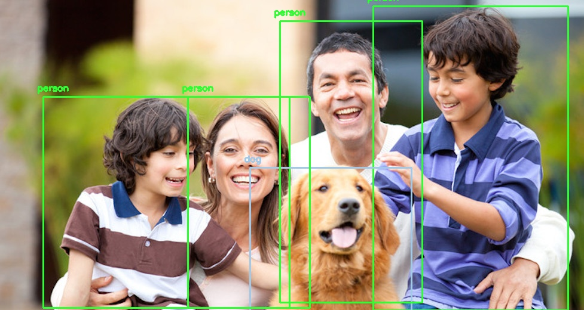

# Object detection using YOLO with OpenCV and Python 

OpenCV `dnn` module supports running inference on pre-trained deep learning models from popular frameworks like Caffe, Torch and TensorFlow. 

When it comes to object detection, popular detection frameworks are
 * YOLO
 * SSD
 * Faster R-CNN
 
 Support for running YOLO/DarkNet has been added to OpenCV dnn module recently. 

 Clone the repository on your local machine by running the below command:
 `$ git clone https://github.com/Azad-mosarof/YOLO-Object-Detection.git'
 
  Remmber before executing this command you should make sure you have git installed in your machine
 
 ## Dependencies
  * opencv
  * numpy
  * Below command will install all the dependency
  `$ pip install -r requirements.txt`

**Note: Compatability with Python 2.x is not officially tested.**

 ## YOLO (You Only Look Once)
 
 Download the pre-trained YOLO v3 weights file from this [link](https://pjreddie.com/media/files/yolov3.weights) and place it in the current directory or you can directly download to the current directory in terminal using
 
 `$ wget https://pjreddie.com/media/files/yolov3.weights`
 
 Provided all the files are in the current directory, below command will apply object detection on the input image `dog.jpg`.
 
 `$ python yolo_opencv.py --image happy_family.jpg --config yolov3.cfg --weights yolov3.weights --classes yolov3.txt`
 
 
 **Command format** 
 
 _$ python yolo_opencv.py --image /path/to/input/image --config /path/to/config/file --weights /path/to/weights/file --classes /path/to/classes/file_
 
 ### sample output :
 
 
Checkout the object detection implementation available in [cvlib](http:cvlib.net) which enables detecting common objects in the context through a single function call `detect_common_objects()`.
